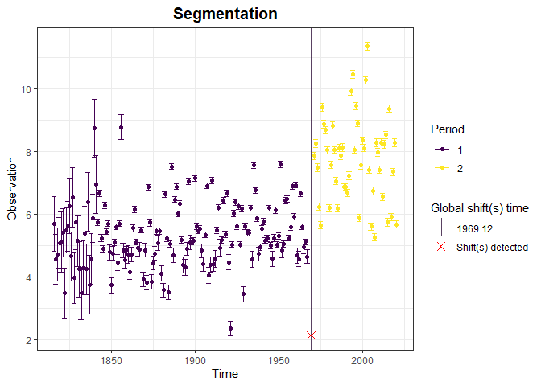
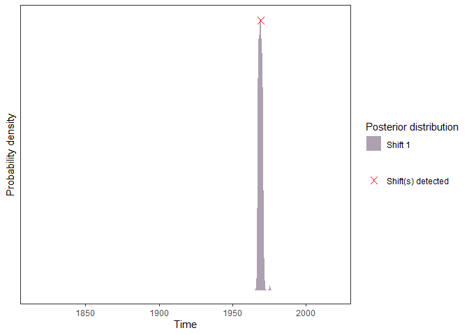
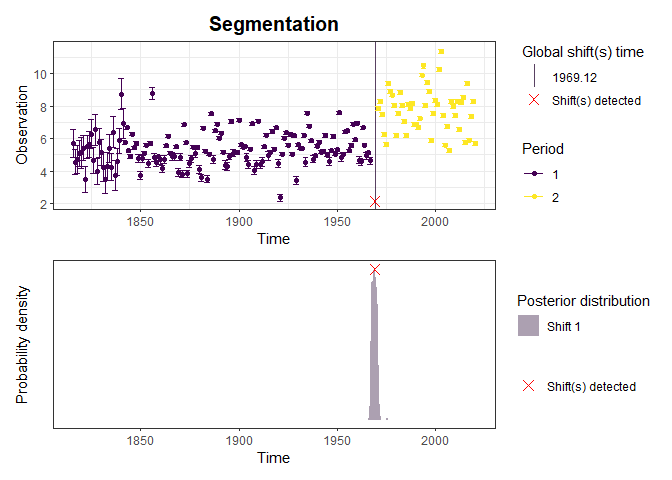

Rating Shift Happens
================
Felipe MENDEZ and Benjamin RENARD (INRAE, RiverLy and RECOVER).
December 2023

## Introduction

Darienzo (2021) developed
[BayDERS](https://github.com/MatteoDarienzo/BayDERS) for detecting and
estimating stage-discharge rating shifts for retrospective and real-time
streamflow quantification. In 2022, a sensibility analysis was conducted
to assess the stability and performance of the tool, leading to multiple
corrections. Nevertheless, debugging the tool proved difficult due to
the integration of different models such as rating curve and recessions
estimation. Hence, a dissociation procedure has been implemented to
extract essential functions, enabling the automatic segmentation of a
random variable. Theses functions have been organized and coded in a
package format, which will be explained below.

The goal of `RatingShiftHappens` package is to create a tools package
for detecting, visualizing and estimating rating shifts. This
documentation provides the description of several functions available to
the segmentation process.

Three fundamental functions are available so far :

1.  segmentation.engine
2.  segmentation
3.  recursive.segmentation

## Installation

You can install the development version of
[RatingShiftHappens](https://github.com/Felipemendezrios/RatingShiftHappens)
from GitHub with:

``` r
# install.packages("devtools")
devtools::install_github("Felipemendezrios/RatingShiftHappens")
devtools::install_github('BaM-tools/RBaM') 

library(RatingShiftHappens)
```

Functions will be explained more precisely below along with a example.

## segmentation.engine function

Segmentation procedure for a **known** given number of segments

This is a basic example which shows you how to segment a random
variable:

``` r
 # Set random generation
 set.seed(1)

 # Create observation vector
 obs=c(rnorm(25,mean=0,sd=1),rnorm(25,mean=2,sd=1))
 nS.user=2

 # Run segmentation engine function
 res <- segmentation.engine(obs=obs,nS=nS.user)

 # Estimated shift time
 res$tau
#> [1] 25.1351

 # intervals defined by time shifts
 if(nS.user!=1){
  intervals.time.shift=c(res$data.p$time[[1]][1],res$tau,rev(res$data.p$time[[nS.user]])[1])
 }else{
  intervals.time.shift=list(res$data.p$time[1],rev(res$data.p$time)[1])
 }

 # Maximum a posterior value per segment indexed by the list number
 res$segments
#> [[1]]
#>  [1] 0.18329 0.18329 0.18329 0.18329 0.18329 0.18329 0.18329 0.18329 0.18329
#> [10] 0.18329 0.18329 0.18329 0.18329 0.18329 0.18329 0.18329 0.18329 0.18329
#> [19] 0.18329 0.18329 0.18329 0.18329 0.18329 0.18329 0.18329
#> 
#> [[2]]
#>  [1] 2.06559 2.06559 2.06559 2.06559 2.06559 2.06559 2.06559 2.06559 2.06559
#> [10] 2.06559 2.06559 2.06559 2.06559 2.06559 2.06559 2.06559 2.06559 2.06559
#> [19] 2.06559 2.06559 2.06559 2.06559 2.06559 2.06559 2.06559

 # Uncertainty in shift time
 if(nS.user!=1){
    Shift=res$mcmc$tau1
    hist(Shift,
         main='Histogram of first shift')

    uncertainty95_shift <- list()
    for(i in 1:(nS.user-1)){
     uncertainty95_shift[[i]] = stats::quantile(res$mcmc[,nS.user+i],probs=c(0.025,0.975))
    }
 }
```



``` r

 # Uncertainty in segment estimation
 mu.seg.1.unc=res$mcmc$mu1
 graphics::hist(mu.seg.1.unc,
                xlab='obs',
                main='Histogram of first segment of observation')
```



``` r
 uncertainty95_segment <- list()
 for(i in 1:nS.user){
    uncertainty95_segment [[i]] = stats::quantile(res$mcmc[,i],probs=c(0.025,0.975))
 }

 # Separate and assign information by identified stable period
 res$data.p
#> $obs.p
#> $obs.p[[1]]
#>  [1] -0.62645381  0.18364332 -0.83562861  1.59528080  0.32950777 -0.82046838
#>  [7]  0.48742905  0.73832471  0.57578135 -0.30538839  1.51178117  0.38984324
#> [13] -0.62124058 -2.21469989  1.12493092 -0.04493361 -0.01619026  0.94383621
#> [19]  0.82122120  0.59390132  0.91897737  0.78213630  0.07456498 -1.98935170
#> [25]  0.61982575
#> 
#> $obs.p[[2]]
#>  [1] 1.9438713 1.8442045 0.5292476 1.5218499 2.4179416 3.3586796 1.8972123
#>  [8] 2.3876716 1.9461950 0.6229404 1.5850054 1.6057100 1.9406866 3.1000254
#> [15] 2.7631757 1.8354764 1.7466383 2.6969634 2.5566632 1.3112443 1.2925048
#> [22] 2.3645820 2.7685329 1.8876538 2.8811077
#> 
#> 
#> $time.p
#> $time.p[[1]]
#>  [1]  1  2  3  4  5  6  7  8  9 10 11 12 13 14 15 16 17 18 19 20 21 22 23 24 25
#> 
#> $time.p[[2]]
#>  [1] 26 27 28 29 30 31 32 33 34 35 36 37 38 39 40 41 42 43 44 45 46 47 48 49 50
#> 
#> 
#> $u.p
#> $u.p[[1]]
#>  [1] 0 0 0 0 0 0 0 0 0 0 0 0 0 0 0 0 0 0 0 0 0 0 0 0 0
#> 
#> $u.p[[2]]
#>  [1] 0 0 0 0 0 0 0 0 0 0 0 0 0 0 0 0 0 0 0 0 0 0 0 0 0
 
 # DIC estimation
 res$DIC
#> [1] 131.985

 # Setting transparency for plotting
 alpha = 125

 # Set color plot
 color_customized_rect <- function(alpha){
    color <-  list(rgb(0, 255, 170, max = 255, alpha = alpha, names ='green'),
                   rgb(0, 221, 255, max = 255, alpha = alpha, names='sky blue'),
                   rgb(255, 0, 255, max = 255, alpha = alpha, names='purple'),
                   rgb(255, 157, 0, max = 255, alpha = alpha, names='orange'),
                   rgb(255, 0, 212, max = 255, alpha = alpha, names='magenta' ))
    return(color)
 }

 # Assign period to data
 obs_segmented <- data.frame()

 # Conditional to separate non segmentation case
 if(typeof(res$data.p$obs.p)=='list'){
   for(i in 1:length(res$data.p$obs.p)){
    obs_segmented_temp=cbind(obs=res$data.p$obs.p[[i]],period=i)
    obs_segmented=rbind(obs_segmented,obs_segmented_temp)
   }
 }else{
  obs_segmented=data.frame(obs=res$data.p$obs.p,period=1)
 }

 # Plot observations
 plot(x=obs_segmented$obs,
      col=factor(obs_segmented$period),
      pch=16,
      main='Final segmentation',
      ylab='obs',
      xlab='time')

 # Plot segments
 for(i in 1:nS.user){
   segments(x0=intervals.time.shift[[i]],
            x1=intervals.time.shift[[i+1]],
            y0=res$segments[[i]],
            y1=res$segments[[i]],
            col='blue')
   rect(xleft=intervals.time.shift[[i]],
        xright=intervals.time.shift[[i+1]],
        ybottom=uncertainty95_segment[[i]][1],
        ytop=uncertainty95_segment[[i]][2],
        col= rgb(0,0,255,max=255,alpha=125,names='blue'),
        border = 'transparent')
 }

 # Plot shifts
 if(nS.user!=1){
  for(i in 1:(nS.user-1)){
   abline(v=res$tau[i],col=color_customized_rect(255)[[i]], lwd=2)
   rect(xleft=uncertainty95_shift[[i]][1],
        xright=rev(uncertainty95_shift[[i]])[1],
        ybottom=min(obs)*2,
        ytop=max(obs)*2,
        col= color_customized_rect(125)[[i]],
        border = 'transparent')
   }
 }
```



## segmentation function

Segmentation procedure for a **unknown** given number of segments

This is a basic example which shows you how to segment a variable with a
**unknown** number of segments:

<!-- # ```{r segmentation} -->
<!-- # # Set random generation -->
<!-- # set.seed(1) -->
<!-- #  -->
<!-- # # Create observation vector -->
<!-- # obs=c(rnorm(25,mean=0,sd=1),rnorm(25,mean=2,sd=1)) -->
<!-- #  -->
<!-- # # Run segmentation function -->
<!-- # res <- segmentation(obs=obs,nSmax = 3) -->
<!-- # # Optimal number of segments nSopt -->
<!-- # nSopt <- res$nS -->
<!-- # nSopt -->
<!-- #  -->
<!-- # # Estimated shift time -->
<!-- # res$results[[nSopt]]$tau -->
<!-- #  -->
<!-- # # Uncertainty in shift time -->
<!-- # Shift=res$results[[nSopt]]$mcmc$tau -->
<!-- # hist(Shift) -->
<!-- #  -->
<!-- # uncertainty95 = quantile(Shift,probs=c(0.025,0.975)) -->
<!-- #  -->
<!-- # # Separate and assign information by identified stable period -->
<!-- # res$results[[nSopt]]$data.p -->
<!-- #  -->
<!-- # # DIC estimation -->
<!-- # res$results[[nSopt]]$DIC -->
<!-- #  -->
<!-- # # Plot -->
<!-- # obs_segmented <- data.frame() -->
<!-- # for(i in 1:length(res$results[[nSopt]]$data.p$obs.p)){ -->
<!-- #   obs_segmented_temp=cbind(obs=res$results[[nSopt]]$data.p$obs.p[[i]],period=i) -->
<!-- #   obs_segmented=rbind(obs_segmented,obs_segmented_temp) -->
<!-- # } -->
<!-- #  -->
<!-- # # Plot -->
<!-- # plot(x=obs_segmented$obs, -->
<!-- #      col=factor(obs_segmented$period), -->
<!-- #      pch=16, -->
<!-- #      main='Final segmentation', -->
<!-- #      ylab='obs', -->
<!-- #      xlab='time') -->
<!-- # lines(x=res$results[[res$nS]]$data.p$time.p[[1]],y=res$results[[res$nS]]$segments[[1]],col='blue') -->
<!-- # lines(x=res$results[[res$nS]]$data.p$time.p[[2]],y=res$results[[res$nS]]$segments[[2]],col='blue') -->
<!-- # abline(v=res$results[[nSopt]]$tau,col='green') -->
<!-- # rect(xleft=uncertainty95[1], -->
<!-- #      xright=uncertainty95[2], -->
<!-- #      ybottom=min(obs)*2, -->
<!-- #      ytop=max(obs)*2,  -->
<!-- #      col= rgb(0,1,0,alpha=0.2), -->
<!-- #      border = 'transparent') -->
<!-- # ``` -->
<!-- #  -->

## recursive.segmentation function

Recursive segmentation procedure for a **unknown** given number of
segments

This is a basic example which shows you how to segment a variable with a
**unknown** number of segments using a recursive process: <!-- #  -->
<!-- #  --> <!-- # ```{r recursive.segmentation} -->
<!-- # # Set random generation --> <!-- # set.seed(1) --> <!-- #  -->
<!-- # # Create series to be segmented -->
<!-- # obs=c(rnorm(30,mean=0,sd=1),rnorm(30,mean=2,sd=1)) -->
<!-- # time=1:length(obs) --> <!-- #  -->
<!-- # # Apply recursive segmentation -->
<!-- # results=recursive.segmentation(obs) -->
<!-- # # Have a look at recursion tree --> <!-- # results$tree -->
<!-- #  --> <!-- # # Get terminal nodes -->
<!-- # terminal=which(results$tree$nS==1) --> <!-- #  -->
<!-- # # Plot original series and terminal nodes defining final segments -->
<!-- # X11();plot(time,obs) --> <!-- # for(i in 1:length(terminal)){ -->
<!-- #   data.stable.p=results$res[[terminal[i]]]$results[[1]]   #Save data from stable period -->
<!-- #   node=list(obs=data.stable.p$data.p$obs.p, -->
<!-- #             times=data.stable.p$data.p$time.p, -->
<!-- #             u=data.stable.p$data.p$u.p) -->
<!-- #   points(node$times,node$obs,col=i) -->
<!-- #   text(node$times,node$obs,terminal[i],pos=3,col=i) -->
<!-- # } --> <!-- # # Get time shifts -->
<!-- # time.shifts=which(results$tree$nS!=1) -->
<!-- # for(i in 1:length(time.shifts)){ -->
<!-- #   nSopt.p = results$res[[time.shifts[[i]]]]$nS -->
<!-- #   abline(v=results$res[[time.shifts[[i]]]]$results[[nSopt.p]]$tau,col='green') -->
<!-- #   abline(v=quantile(results$res[[time.shifts[[i]]]]$results[[nSopt.p]]$mcmc$tau1,probs=c(0.025,0.975)),col='green',lty=2) -->
<!-- #   segments( -->
<!-- #     x0=results$res[[time.shifts[[i]]]]$results[[nSopt.p]]$data.p$time.p[[1]][1], -->
<!-- #     x1=results$res[[time.shifts[[i]]]]$results[[nSopt.p]]$tau, -->
<!-- #     y0=results$res[[time.shifts[[i]]]]$results[[nSopt.p]]$segments[[1]], -->
<!-- #     y1=results$res[[time.shifts[[i]]]]$results[[nSopt.p]]$segments[[1]], -->
<!-- #     col='blue') --> <!-- #   segments( -->
<!-- #     x0=results$res[[time.shifts[[i]]]]$results[[nSopt.p]]$tau, -->
<!-- #     x1=rev(results$res[[time.shifts[[i]]]]$results[[nSopt.p]]$data.p$time.p[[2]])[1], -->
<!-- #     y0=results$res[[time.shifts[[i]]]]$results[[nSopt.p]]$segments[[2]], -->
<!-- #     y1=results$res[[time.shifts[[i]]]]$results[[nSopt.p]]$segments[[2]], -->
<!-- #     col='blue') --> <!-- # } --> <!-- #  -->
<!-- # # Visualize tree with data.tree package -->
<!-- # if(NROW(results$tree)>1){ -->
<!-- #   tree <- data.tree::as.Node(results$tree[-1,c(3,1)],mode = "network") -->
<!-- #   plot(tree) -->
<!-- # } else { # No segmentation took place, make a dummy plot -->
<!-- #   tree <- data.tree::as.Node(data.frame(1,2),mode = "network") -->
<!-- #   plot(tree) --> <!-- # } --> <!-- # ``` -->

Here other example to show \_\_\_\_\_

<!-- # ```{r example} -->
<!-- #  -->
<!-- # ``` -->

devtools::build\_readme()
