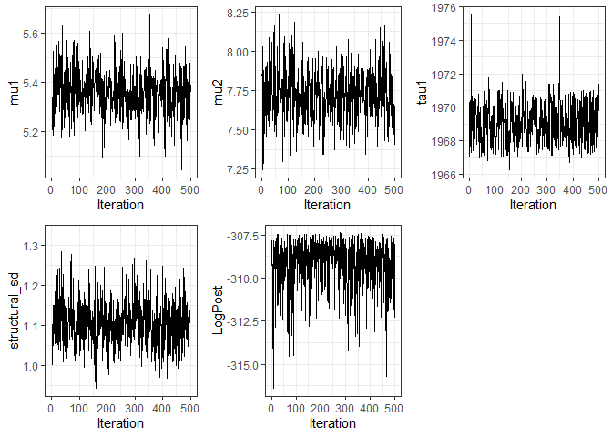
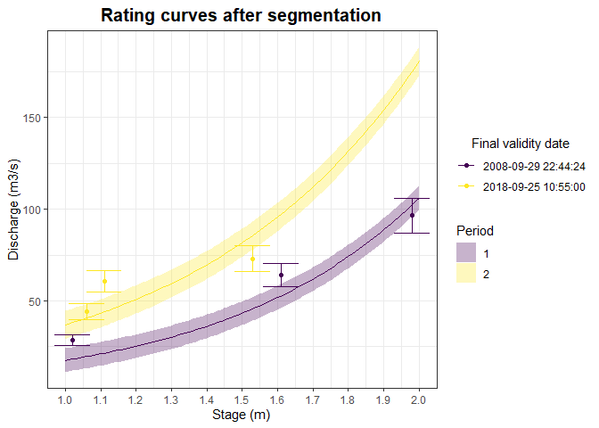

Rating Shift Happens
================
Felipe MENDEZ and Benjamin RENARD (INRAE, RiverLy and RECOVER).
December 2023

## Introduction

The goal of `RatingShiftHappens` package is to create a tools package
for detecting, visualizing and estimating rating shifts. This package
was derived from [BayDERS](https://github.com/MatteoDarienzo/BayDERS)
developed by Darienzo in 2021.

This documentation provides the description of several functions
available to the segmentation process.

Three fundamental functions are available so far :

1.  segmentation.engine
2.  segmentation
3.  recursive.segmentation

## Installation

You can install the development version of
[RatingShiftHappens](https://github.com/Felipemendezrios/RatingShiftHappens)
from GitHub using the following command. Please note that the
[RBaM](https://github.com/BaM-tools/RBaM) package is also required to
run this package.

``` r
# Before first use, install Rating Shift Happens and RBaM packages ones and for all, following these commands: 

# devtools::install_github("Felipemendezrios/RatingShiftHappens")
# devtools::install_github('BaM-tools/RBaM') 

library(RatingShiftHappens)
```

Functions will be explained more precisely below along with an example.

## Segmentation procedure for a *known* given number of segments

This basic example demonstrates the segmentation of annual maximum
stages (H, m) for the Rhone River at Beaucaire, France, along with the
associated uncertainties expressed as standard deviations (uH), divided
into two groups. More information about the data set, please refer to
the documentation available in `?RhoneRiver`.

``` r
 # Run segmentation engine function at two segments
 res=segmentation.engine(obs=RhoneRiver$H,time=RhoneRiver$Year,u=RhoneRiver$uH,nS=2)

 # Data information
 knitr::kable(head(res$summary$data),
              align = 'c',row.names = F)
```

| time | obs  |   u    | I95_lower | I95_upper | period |
|:----:|:----:|:------:|:---------:|:---------:|:------:|
| 1816 | 5.69 | 0.4500 | 4.808016  | 6.571984  |   1    |
| 1817 | 4.56 | 0.4075 | 3.761315  | 5.358685  |   1    |
| 1818 | 4.72 | 0.4300 | 3.877216  | 5.562785  |   1    |
| 1819 | 5.08 | 0.4125 | 4.271515  | 5.888485  |   1    |
| 1820 | 5.12 | 0.4925 | 4.154718  | 6.085282  |   1    |
| 1821 | 5.40 | 0.3900 | 4.635614  | 6.164386  |   1    |

``` r
 # Shift information
 knitr::kable(head(res$summary$shift),
              align = 'c',row.names = F)
```

|   tau   | I95_lower | I95_upper |
|:-------:|:---------:|:---------:|
| 1969.12 |  1967.09  |  1971.35  |

``` r
 # Plot segmentation
 plotSegmentation(res$summary)
```


## For more advanced details :

MCMC sampling demonstrate all combinations of parameters estimated.

``` r
knitr::kable(head(res$mcmc),align = 'c')
```

|   mu1   |   mu2   |  tau1   | structural_sd | LogPost  |
|:-------:|:-------:|:-------:|:-------------:|:--------:|
| 5.20155 | 7.83626 | 1967.03 |    1.07363    | -309.191 |
| 5.33280 | 7.87847 | 1970.18 |    1.10196    | -307.813 |
| 5.33280 | 7.82841 | 1970.42 |    1.00044    | -309.262 |
| 5.34227 | 8.03573 | 1967.69 |    1.09610    | -309.200 |
| 5.52388 | 7.24338 | 1967.76 |    1.14877    | -314.065 |
| 5.24600 | 7.32321 | 1969.19 |    1.14107    | -311.731 |

A few functions are provided with the `RBaM` package to explore MCMC
samples.

``` r
  # Trace plot for each parameter, useful to assess convergence.
  plots=RBaM::tracePlot(res$mcmc)
  gridExtra::grid.arrange(grobs=plots,ncol=3)
```



``` r
  # Density plot for each parameter
  plots=RBaM::densityPlot(res$mcmc)
  gridExtra::grid.arrange(grobs=plots,ncol=3)
```


In this example, the focus will be on exploring the uncertainty
associated with the first shift time.

``` r
 Shift=data.frame(time=res$mcmc$tau1)
 ggplot2::ggplot(Shift,ggplot2::aes(x=time))+
   ggplot2::geom_histogram(ggplot2::aes(y=..density..),col=1,fill='white',bins=80)+
   ggplot2::labs(title='Histogram with density of first shift')+
   ggplot2::theme_bw()+
   ggplot2::theme(plot.title = ggplot2::element_text(hjust = 0.5))+
   ggplot2::geom_density(col=4,lwd=1,fill=4,alpha=0.25)
```


## Segmentation procedure for an *unknown* number of segments

This is a basic example, which shows you how to segment the same dataset
with an **unknown** number of segments :

``` r
 # Run segmentation engine function at two segments
 res=segmentation(obs=RhoneRiver$H,time=RhoneRiver$Year,u=RhoneRiver$uH,nSmax=3)

 # Get lower DIC value and optimal number of segments (to define optimal solution)
 DIC.df = data.frame(nS=c(1:3),DIC=c(res$results[[1]]$DIC,res$results[[2]]$DIC,res$results[[3]]$DIC))
 nSopt=res$nS
 
 ggplot2::ggplot(DIC.df,ggplot2::aes(x=nS,y=DIC,col=factor(nS)))+
   ggplot2::geom_point(size=3,show.legend = F)+
   ggplot2::geom_segment(ggplot2::aes(x=nSopt,y=min(DIC)*1.03,xend=nSopt,yend=min(DIC)*1.005),
                         arrow=ggplot2::arrow(length=ggplot2::unit(0.5,'cm')),
                         color='BLACK',lwd=1, show.legend = F)+
   ggplot2::theme_bw()
```


``` r
 # Data information
 knitr::kable(head(res$results[[nSopt]]$summary$data),
              align = 'c',row.names = F)
```

| time | obs  |   u    | I95_lower | I95_upper | period |
|:----:|:----:|:------:|:---------:|:---------:|:------:|
| 1816 | 5.69 | 0.4500 | 4.808016  | 6.571984  |   1    |
| 1817 | 4.56 | 0.4075 | 3.761315  | 5.358685  |   1    |
| 1818 | 4.72 | 0.4300 | 3.877216  | 5.562785  |   1    |
| 1819 | 5.08 | 0.4125 | 4.271515  | 5.888485  |   1    |
| 1820 | 5.12 | 0.4925 | 4.154718  | 6.085282  |   1    |
| 1821 | 5.40 | 0.3900 | 4.635614  | 6.164386  |   1    |

``` r
 # Shift information
 knitr::kable(head(res$results[[nSopt]]$summary$shift),
              align = 'c',row.names = F)
```

|   tau   | I95_lower | I95_upper |
|:-------:|:---------:|:---------:|
| 1969.12 |  1967.09  |  1971.35  |

``` r
 # Plot segmentation
 plotSegmentation(res$summary)
```


## Recursive segmentation procedure for an *unknown* number of segments

This is a basic example, which shows you how to segment the data set
with an **unknown** number of segments using a recursive process:

``` r
 # Apply recursive segmentation
 results=recursive.segmentation(obs=RhoneRiver$H,time=RhoneRiver$Year,u=RhoneRiver$uH,nSmax=3)
 
 # Data information
 knitr::kable(head(results$summary$data),
              align = 'c',row.names = F)
```

| time | obs  |   u    | I95_lower | I95_upper | period |
|:----:|:----:|:------:|:---------:|:---------:|:------:|
| 1816 | 5.69 | 0.4500 | 4.808016  | 6.571984  |   1    |
| 1817 | 4.56 | 0.4075 | 3.761315  | 5.358685  |   1    |
| 1818 | 4.72 | 0.4300 | 3.877216  | 5.562785  |   1    |
| 1819 | 5.08 | 0.4125 | 4.271515  | 5.888485  |   1    |
| 1820 | 5.12 | 0.4925 | 4.154718  | 6.085282  |   1    |
| 1821 | 5.40 | 0.3900 | 4.635614  | 6.164386  |   1    |

``` r
 # Shift information
 knitr::kable(head(results$summary$shift),
              align = 'c',row.names = F)
```

|   tau   | I95_lower | I95_upper |
|:-------:|:---------:|:---------:|
| 1969.12 |  1967.09  |  1971.35  |

``` r
 # Have a look at recursion tree
 results$tree
#>   indx level parent nS
#> 1    1     1      0  2
#> 2    2     2      1  1
#> 3    3     2      1  1

 # Visualize tree structure
 plotTree(results$tree)
```


``` r
 # Plot segmentation
 plotSegmentation(summary=results$summary)
```


## Hydrometry field

Detection and segmentation has only been performed for residual from a
random variable thus far. However, in the field of hydrometry, one of
the objectives is to predict discharge from stage using a rating curve.

## Fitting models

Several fitting models with their equations are supported in the
package. For more details, refer to `GetCatalog` to determine which
model could be used to estimate the rating curve.

``` r
# Get model available to estimate the rating curve
GetCatalog()$models
#> [1] "fitRC_loess"               "fitRC_BaRatin"            
#> [3] "fitRC_exponential"         "fitRC_LinearInterpolation"

# Get equation of each model
GetCatalog()$Equations
#> [1] "Loess_Equation"               "BaRatin_Equation"            
#> [3] "Exponential_Equation"         "LinearInterpolation_Equation"
```

All these equations Q(h) allow for the proper transformation of stage to
discharge, following the specified assumption for each fitting model.

Models can either be non-parametric, such as as `fitRC_loess`, which
relies solely on data for calculation, or parametric, like
`fitRC_BaRatin` with three parameters (a,b,c), integrating physics and
geometry proprieties of the river in the estimation process.

Hereafter, the employed model will be an exponential regression
(`fitRC_exponential`), estimating discharge using two parameters,
denoted as ‘a’ and ‘b’, following this equation : $Q(h) = ae^{(bh)}$

## Dataset

The Ardèche hydrometric station at Meyras is introduced as a new
dataset, further information in `?ArdecheRiverMeyrasGaugings`. The
dataset includes stages (H, in meters) and discharge ADCP measurements
(Q, in cubic meters per second) all accompanied by uncertainties.

``` r
knitr::kable(head(ArdecheRiverMeyrasGaugings),
              align = 'c',row.names = F)
```

| Day | Month | Year | Hour | Minute | Second |        Date         |  H   |   Q   |   uQ    |
|:---:|:-----:|:----:|:----:|:------:|:------:|:-------------------:|:----:|:-----:|:-------:|
|  7  |  11   | 2001 |  16  |   30   |   0    | 2001-11-07 16:30:00 | 0.17 | 1.520 | 0.10640 |
|  4  |  12   | 2001 |  14  |   45   |   0    | 2001-12-04 14:45:00 | 0.10 | 0.727 | 0.05089 |
| 10  |   1   | 2002 |  14  |   0    |   0    | 2002-01-10 14:00:00 | 0.06 | 0.500 | 0.03500 |
| 13  |   2   | 2002 |  16  |   45   |   0    | 2002-02-13 16:45:00 | 0.08 | 1.110 | 0.07770 |
| 23  |   4   | 2002 |  17  |   45   |   0    | 2002-04-23 17:45:00 | 0.17 | 1.740 | 0.12180 |
|  2  |   5   | 2002 |  13  |   40   |   0    | 2002-05-02 13:40:00 | 0.22 | 2.370 | 0.16590 |

## Recursive model and segmentation procedure for an *unknown* number of segments

This function enables the modeling of the rating curve and ensures its
continual update at each segmentation for an *unkown* number of
segments. This approach leads to a better fit for the model as it is
consistently updated with data from the current period.

``` r
# Apply recursive model and segmentation
results=recursive.ModelAndSegmentation(H=ArdecheRiverMeyrasGaugings$H,Q=ArdecheRiverMeyrasGaugings$Q,
                                       time=ArdecheRiverMeyrasGaugings$Date,
                                       uQ=ArdecheRiverMeyrasGaugings$uQ,
                                       nSmax=2,nMin=2,funk=fitRC_exponential)

# Data information
knitr::kable(head(results$summary$data),
             align = 'c',row.names = FALSE)
```

|        time         |  H   |   Q   |   uQ    | Q_I95_lower | Q_I95_upper |   Qsim   |  uQ_sim  | Qsim_I95_lower | Qsim_I95_upper |   Qres    | period |
|:-------------------:|:----:|:-----:|:-------:|:-----------:|:-----------:|:--------:|:--------:|:--------------:|:--------------:|:---------:|:------:|
| 2001-11-07 16:30:00 | 0.17 | 1.520 | 0.10640 |  1.3114598  |  1.7285402  | 3.927984 | 3.281194 |   -2.503038    |   10.359006    | -2.407984 |   1    |
| 2001-12-04 14:45:00 | 0.10 | 0.727 | 0.05089 |  0.6272574  |  0.8267426  | 3.462622 | 3.281194 |   -2.968400    |    9.893644    | -2.735622 |   1    |
| 2002-01-10 14:00:00 | 0.06 | 0.500 | 0.03500 |  0.4314013  |  0.5685987  | 3.221893 | 3.281194 |   -3.209129    |    9.652915    | -2.721893 |   1    |
| 2002-02-13 16:45:00 | 0.08 | 1.110 | 0.07770 |  0.9577108  |  1.2622892  | 3.340089 | 3.281194 |   -3.090933    |    9.771111    | -2.230090 |   1    |
| 2002-04-23 17:45:00 | 0.17 | 1.740 | 0.12180 |  1.5012764  |  1.9787236  | 3.927984 | 3.281194 |   -2.503038    |   10.359006    | -2.187984 |   1    |
| 2002-05-02 13:40:00 | 0.22 | 2.370 | 0.16590 |  2.0448420  |  2.6951580  | 4.298207 | 3.281194 |   -2.132815    |   10.729229    | -1.928207 |   1    |

``` r

# Shift information
knitr::kable(head(results$summary$shift),
            align = 'c',row.names = FALSE)
```

|         tau         |      I95_lower      |      I95_upper      |
|:-------------------:|:-------------------:|:-------------------:|
| 2008-09-15 07:37:12 | 2006-09-15 20:12:07 | 2010-02-21 03:44:38 |

``` r

# Parameters estimation of the rating curve
results$summary$param.equation
#>          a        b  c
#> 1 2.891811 1.801431 NA
#> 2 7.491781 1.591981 NA

# Have a look at recursion tree
results$tree
#>   indx level parent nS
#> 1    1     1      0  2
#> 2    2     2      1  1
#> 3    3     2      1  1
```

Several plot functions are available to simplify graphical
representation, aligning with the structure of specific functions
integrated in the package:

``` r
# Visualize tree structure
plotTree(results$tree)
```


``` r

# Plot the rating curve after segmentation following a regression exponential
plotRC_ModelAndSegmentation(summary=results$summary,equation = Exponential_Equation)
```


``` r

# Plot the rating curves after segmentation with zoom user-defined
plotRC_ModelAndSegmentation(summary=results$summary,equation = Exponential_Equation, autoscale = FALSE, Hmin_user = 1, Hmax_user = 2, H_step_discretization = 0.01)
```



``` r

# Plot the rating curves after segmentation in log scale
plotRC_ModelAndSegmentation(summary=results$summary,logscale=TRUE,equation = Exponential_Equation)
#> Coordinate system already present. Adding new coordinate system, which will
#> replace the existing one.
```


``` r

# Plot the rating curves after segmentation in log scale with zoom
plotRC_ModelAndSegmentation(summary=results$summary,logscale=TRUE,equation = Exponential_Equation, autoscale = FALSE, Hmin_user = 0.5, Hmax_user = 2, H_step_discretization = 0.01)
#> Coordinate system already present. Adding new coordinate system, which will
#> replace the existing one.
```


``` r

# Plot shift times in stage record
plotStage_ModelAndSegmentation(summary=results$summary)
```


``` r

# Plot residual
plotResidual_ModelAndSegmentation(summary=results$summary)
```


