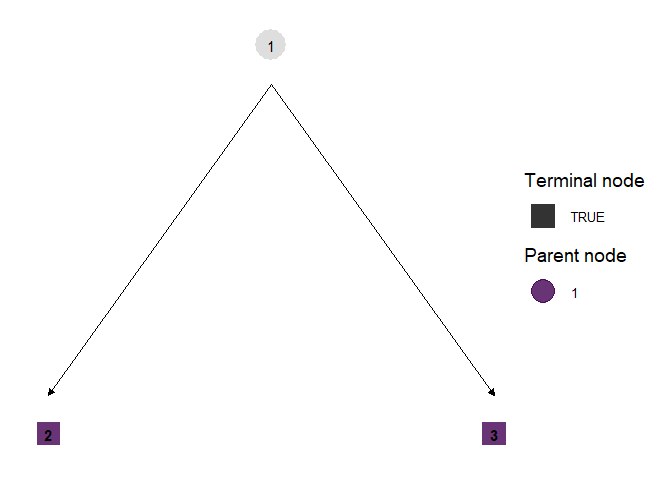
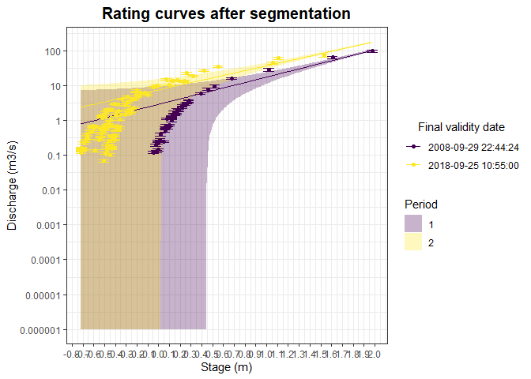
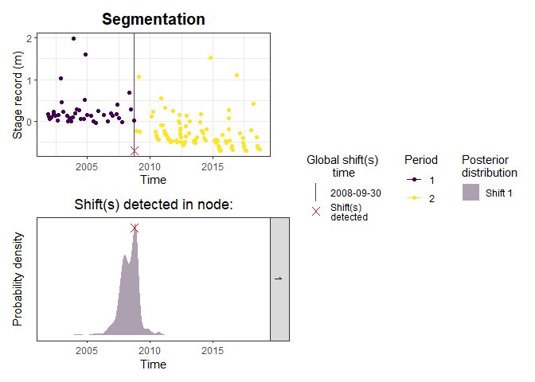
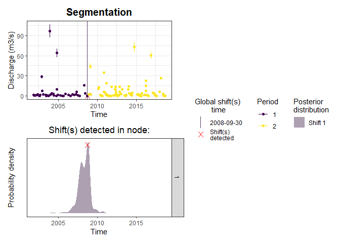
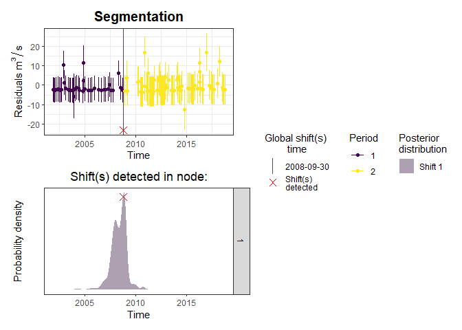
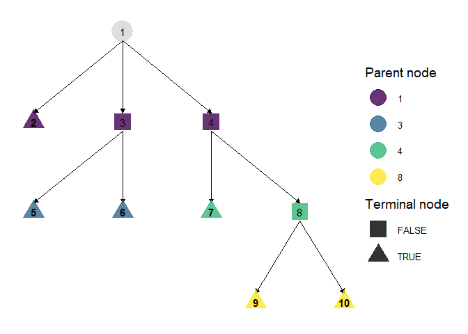
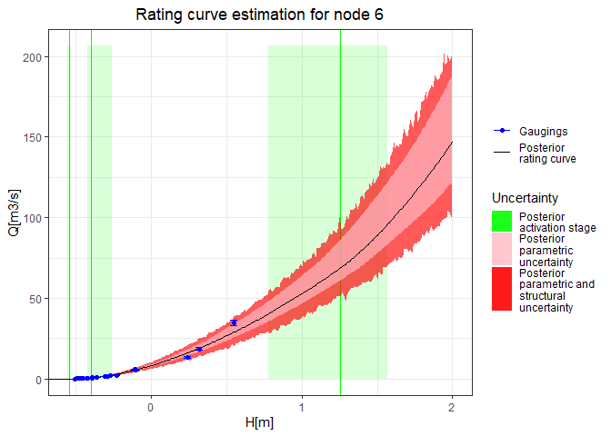
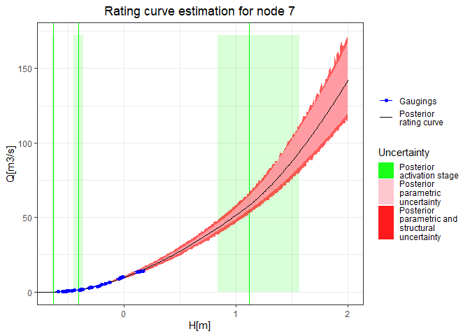
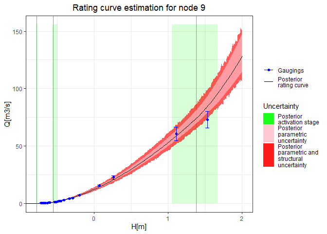
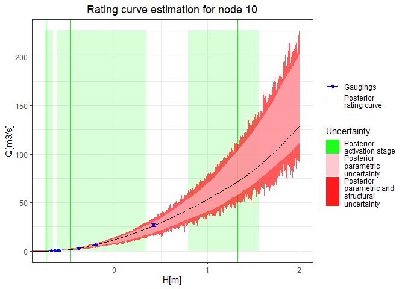

Rating Shift Happens
================
Felipe MENDEZ and Benjamin RENARD (INRAE, RiverLy and RECOVER).
December 2023

## Introduction

The goal of `RatingShiftHappens` package is to create a tools package
for detecting, visualizing and estimating rating shifts. This package
was derived from [BayDERS](https://github.com/MatteoDarienzo/BayDERS)
developed by [Darienzo (2021)](https://theses.hal.science/tel-03211343).

This documentation provides the description of several functions
available to the segmentation process.

Three fundamental functions are available to segment a random variable :

1.  segmentation.engine
2.  segmentation
3.  recursive.segmentation

## Installation

You can install the development version of
[RatingShiftHappens](https://github.com/Felipemendezrios/RatingShiftHappens)
from GitHub using the following command. Please note that the
[RBaM](https://github.com/BaM-tools/RBaM) package developed by [Renard
(2017)](https://hal.inrae.fr/hal-02606929) is also required to run this
package.

``` r
# Before first use, install Rating Shift Happens and RBaM packages ones and for all, following these commands: 

# devtools::install_github("Felipemendezrios/RatingShiftHappens")
# devtools::install_github('BaM-tools/RBaM') 

library(RatingShiftHappens)
```

Functions will be explained more precisely below along with an example.

## Segmentation procedure for a *known* given number of segments

This basic example demonstrates the segmentation of annual maximum
stages (H, m) for the Rhone River at Beaucaire, France, along with the
associated uncertainties expressed as standard deviations (uH), divided
into two groups. More information about the data set, please refer to
the documentation available in `?RhoneRiver`.

``` r
 # Run segmentation engine function at two segments
 res=segmentation.engine(obs=RhoneRiver$H,
                         time=RhoneRiver$Year,
                         u=RhoneRiver$uH,
                         nS=2)
 # Data information
 knitr::kable(head(res$summary$data),
              align = 'c',row.names = F)
```

| time | obs  |   u    | I95_lower | I95_upper | period |
|:----:|:----:|:------:|:---------:|:---------:|:------:|
| 1816 | 5.69 | 0.4500 | 4.808016  | 6.571984  |   1    |
| 1817 | 4.56 | 0.4075 | 3.761315  | 5.358685  |   1    |
| 1818 | 4.72 | 0.4300 | 3.877216  | 5.562785  |   1    |
| 1819 | 5.08 | 0.4125 | 4.271515  | 5.888485  |   1    |
| 1820 | 5.12 | 0.4925 | 4.154718  | 6.085282  |   1    |
| 1821 | 5.40 | 0.3900 | 4.635614  | 6.164386  |   1    |

``` r
 # Shift information
 knitr::kable(head(res$summary$shift),
              align = 'c',row.names = F)
```

|   tau   | I95_lower | I95_upper |
|:-------:|:---------:|:---------:|
| 1969.12 |  1967.09  |  1971.35  |

``` r
 # Plot segmentation
 Plots=plotSegmentation(summary=res$summary,
                        plot_summary=res$plot)
 
 # Observations of the random variable and shift time estimated 
 Plots$observation_and_shift
```


``` r
 
 # Probability distribution function for detecting shift time with a 95% credibility interval 
 Plots$shift_time_density
```


``` r
 
 # Final plot segmentation
 Plots$final_plot
```


## For more advanced details :

MCMC sampling demonstrate all combinations of parameters estimated.

``` r
knitr::kable(head(res$mcmc),align = 'c')
```

|   mu1   |   mu2   |  tau1   | structural_sd | LogPost  |
|:-------:|:-------:|:-------:|:-------------:|:--------:|
| 5.20155 | 7.83626 | 1967.03 |    1.07363    | -309.191 |
| 5.33280 | 7.87847 | 1970.18 |    1.10196    | -307.813 |
| 5.33280 | 7.82841 | 1970.42 |    1.00044    | -309.262 |
| 5.34227 | 8.03573 | 1967.69 |    1.09610    | -309.200 |
| 5.52388 | 7.24338 | 1967.76 |    1.14877    | -314.065 |
| 5.24600 | 7.32321 | 1969.19 |    1.14107    | -311.731 |

The `RBaM` package provides several functions to explore MCMC samples.

``` r
  # Trace plot for each parameter, useful to assess convergence.
  plots=RBaM::tracePlot(res$mcmc)
  gridExtra::grid.arrange(grobs=plots,ncol=3)
```


``` r
  # Density plot for each parameter
  plots=RBaM::densityPlot(res$mcmc)
  gridExtra::grid.arrange(grobs=plots,ncol=3)
```


In this example, the focus will be on exploring the uncertainty
associated with the first shift time.

``` r
 Shift=data.frame(time=res$mcmc$tau1)
 ggplot2::ggplot(Shift,ggplot2::aes(x=time))+
   ggplot2::geom_histogram(ggplot2::aes(y=..density..),col=1,fill='white',bins=80)+
   ggplot2::labs(title='Histogram with density of first shift')+
   ggplot2::theme_bw()+
   ggplot2::theme(plot.title = ggplot2::element_text(hjust = 0.5))+
   ggplot2::geom_density(col=4,lwd=1,fill=4,alpha=0.25)
```


## Segmentation procedure for an *unknown* number of segments

This is a basic example, which shows you how to segment the same dataset
with an **unknown** number of segments :

``` r
 # Run segmentation engine function at two segments
 res=segmentation(obs=RhoneRiver$H,
                  time=RhoneRiver$Year,
                  u=RhoneRiver$uH,
                  nSmax=3)

 # Get lower DIC value and optimal number of segments (to define optimal solution)
 DIC.df = data.frame(nS=c(1:3),DIC=c(res$results[[1]]$DIC,res$results[[2]]$DIC,res$results[[3]]$DIC))
 nSopt=res$nS
 
 ggplot2::ggplot(DIC.df,ggplot2::aes(x=nS,y=DIC,col=factor(nS)))+
   ggplot2::geom_point(size=3,show.legend = F)+
   ggplot2::annotate('segment',
                     x=nSopt,y=min(DIC.df$DIC)*1.03,xend=nSopt,yend=min(DIC.df$DIC)*1.01,
                     linewidth=2,linejoin = "mitre",
                     arrow=ggplot2::arrow(type='closed',length=ggplot2::unit(0.01,'npc')))+
   ggplot2::theme_bw()
```


``` r
 # Data information
 knitr::kable(head(res$results[[nSopt]]$summary$data),
              align = 'c',row.names = F)
```

| time | obs  |   u    | I95_lower | I95_upper | period |
|:----:|:----:|:------:|:---------:|:---------:|:------:|
| 1816 | 5.69 | 0.4500 | 4.808016  | 6.571984  |   1    |
| 1817 | 4.56 | 0.4075 | 3.761315  | 5.358685  |   1    |
| 1818 | 4.72 | 0.4300 | 3.877216  | 5.562785  |   1    |
| 1819 | 5.08 | 0.4125 | 4.271515  | 5.888485  |   1    |
| 1820 | 5.12 | 0.4925 | 4.154718  | 6.085282  |   1    |
| 1821 | 5.40 | 0.3900 | 4.635614  | 6.164386  |   1    |

``` r
 # Shift information
 knitr::kable(head(res$results[[nSopt]]$summary$shift),
              align = 'c',row.names = F)
```

|   tau   | I95_lower | I95_upper |
|:-------:|:---------:|:---------:|
| 1969.12 |  1967.09  |  1971.35  |

``` r
 # Final plot segmentation
 plotSegmentation(summary=res$summary,
                  plot_summary = res$plot)$final_plot
```


## Recursive segmentation procedure for an *unknown* number of segments

This is a basic example, which shows you how to segment the data set
with an **unknown** number of segments using a recursive process:

``` r
 # Apply recursive segmentation
 results=recursive.segmentation(obs=RhoneRiver$H,
                                time=RhoneRiver$Year,
                                u=RhoneRiver$uH,
                                nSmax=3)
 
 # Data information
 knitr::kable(head(results$summary$data),
              align = 'c',row.names = F)
```

| time | obs  |   u    | I95_lower | I95_upper | period |
|:----:|:----:|:------:|:---------:|:---------:|:------:|
| 1816 | 5.69 | 0.4500 | 4.808016  | 6.571984  |   1    |
| 1817 | 4.56 | 0.4075 | 3.761315  | 5.358685  |   1    |
| 1818 | 4.72 | 0.4300 | 3.877216  | 5.562785  |   1    |
| 1819 | 5.08 | 0.4125 | 4.271515  | 5.888485  |   1    |
| 1820 | 5.12 | 0.4925 | 4.154718  | 6.085282  |   1    |
| 1821 | 5.40 | 0.3900 | 4.635614  | 6.164386  |   1    |

``` r
 # Shift information
 knitr::kable(head(results$summary$shift),
              align = 'c',row.names = F)
```

|   tau   | I95_lower | I95_upper | id_iteration |
|:-------:|:---------:|:---------:|:------------:|
| 1969.12 |  1967.09  |  1971.35  |      1       |

``` r
 # Have a look at recursion tree
 results$tree
#>   indx level parent nS
#> 1    1     1      0  2
#> 2    2     2      1  1
#> 3    3     2      1  1

 # Visualize tree structure
 plotTree(tree=results$tree)
```


``` r
 
 # Final plot segmentation
 plotSegmentation(summary=results$summary,
                  plot_summary = results$plot)$final_plot
```


## Hydrometry field

Detection and segmentation has only been performed for the residual of a
random variable thus far. However, in the field of hydrometry,one of the
objectives is to predict discharge from stage, using a rating curve that
can vary over time.

## Fitting models

Many models are available to describe the rating curve. All fitting
models with their equations supported by the package are listed below.
For more details, refer to `GetCatalog()` to determine which model could
be used to estimate the rating curve.

``` r
# Get model available to estimate the rating curve
GetCatalog()$models
#> [1] "fitRC_loess"            "fitRC_BaRatin"          "fitRC_exponential"     
#> [4] "fitRC_LinearRegression"

# Get equation of each model
GetCatalog()$Equations
#> [1] "Loess_Equation"            "BaRatin_Equation"         
#> [3] "Exponential_Equation"      "LinearRegression_Equation"
```

All these equations Q(h) allow for the proper transformation of stage to
discharge, following the specified assumption for each fitting model.

Models can either be non-parametric, such as as `fitRC_loess`, which
relies solely on data for calculation, or parametric, like
`fitRC_BaRatin` with three parameters (a,b,c) per hydraulic control,
integrating physics and geometry proprieties of the river in the
estimation process.

Hereafter, the employed model will be an exponential regression
(`fitRC_exponential`) and the BaRatin model for estimating discharge.

The exponential regression needs two parameters, denoted as *a* and *b*,
following the equation :

$Q(h) = a \cdot e^{(b \cdot h)}$

The BaRatin model needs the parameters *a*, *b* and *c* per hydraulic
control, following the equation :

$Q(h) = a \cdot (h-b)^{c} \quad \text{for } (h>k) \quad (\text{and } Q=0 \quad \text{if } h \leq b)$

## Dataset

The Ardèche hydrometric station at Meyras is introduced as a new
dataset, further information in `?ArdecheRiverMeyrasGaugings`. The
dataset includes stages (H, in meters) and discharge ADCP measurements
(Q, in cubic meters per second) all accompanied by uncertainties.

``` r
knitr::kable(head(ArdecheRiverMeyrasGaugings),
              align = 'c',row.names = F)
```

| Day | Month | Year | Hour | Minute | Second |        Date         |  H   |   Q   |   uQ    |
|:---:|:-----:|:----:|:----:|:------:|:------:|:-------------------:|:----:|:-----:|:-------:|
|  7  |  11   | 2001 |  16  |   30   |   0    | 2001-11-07 16:30:00 | 0.17 | 1.520 | 0.10640 |
|  4  |  12   | 2001 |  14  |   45   |   0    | 2001-12-04 14:45:00 | 0.10 | 0.727 | 0.05089 |
| 10  |   1   | 2002 |  14  |   0    |   0    | 2002-01-10 14:00:00 | 0.06 | 0.500 | 0.03500 |
| 13  |   2   | 2002 |  16  |   45   |   0    | 2002-02-13 16:45:00 | 0.08 | 1.110 | 0.07770 |
| 23  |   4   | 2002 |  17  |   45   |   0    | 2002-04-23 17:45:00 | 0.17 | 1.740 | 0.12180 |
|  2  |   5   | 2002 |  13  |   40   |   0    | 2002-05-02 13:40:00 | 0.22 | 2.370 | 0.16590 |

## Recursive model and segmentation procedure for an *unknown* number of segments

This function enables the modeling of the rating curve and ensures its
continual update at each segmentation for an **unknown** number of
segments. This approach leads to a better fit for the model as it is
consistently updated with data from the current period.

### Rating curve using exponential regression

An exponential regression model is employed to construct the rating
curve using observed data point represented by stage and discharge
information. This regression estimates the relationships between a
dependent variable and one independent variables from a statistical
perspective.

``` r
# Apply recursive model and segmentation
results=recursive.ModelAndSegmentation(H=ArdecheRiverMeyrasGaugings$H,Q=ArdecheRiverMeyrasGaugings$Q,
                                       time=ArdecheRiverMeyrasGaugings$Date,
                                       uQ=ArdecheRiverMeyrasGaugings$uQ,
                                       nSmax=2,nMin=2,funk=fitRC_exponential)

# Data information
knitr::kable(head(results$summary$data),
             align = 'c',row.names = FALSE)
```

|        time         |  H   |   Q   |   uQ    | Q_I95_lower | Q_I95_upper |   Qsim   |  uQ_sim  | Qsim_I95_lower | Qsim_I95_upper |   Qres    | period |
|:-------------------:|:----:|:-----:|:-------:|:-----------:|:-----------:|:--------:|:--------:|:--------------:|:--------------:|:---------:|:------:|
| 2001-11-07 16:30:00 | 0.17 | 1.520 | 0.10640 |  1.3114598  |  1.7285402  | 3.927984 | 3.281194 |   -2.503038    |   10.359006    | -2.407984 |   1    |
| 2001-12-04 14:45:00 | 0.10 | 0.727 | 0.05089 |  0.6272574  |  0.8267426  | 3.462622 | 3.281194 |   -2.968400    |    9.893644    | -2.735622 |   1    |
| 2002-01-10 14:00:00 | 0.06 | 0.500 | 0.03500 |  0.4314013  |  0.5685987  | 3.221893 | 3.281194 |   -3.209129    |    9.652915    | -2.721893 |   1    |
| 2002-02-13 16:45:00 | 0.08 | 1.110 | 0.07770 |  0.9577108  |  1.2622892  | 3.340089 | 3.281194 |   -3.090933    |    9.771111    | -2.230090 |   1    |
| 2002-04-23 17:45:00 | 0.17 | 1.740 | 0.12180 |  1.5012764  |  1.9787236  | 3.927984 | 3.281194 |   -2.503038    |   10.359006    | -2.187984 |   1    |
| 2002-05-02 13:40:00 | 0.22 | 2.370 | 0.16590 |  2.0448420  |  2.6951580  | 4.298207 | 3.281194 |   -2.132815    |   10.729229    | -1.928207 |   1    |

``` r

# Shift information
knitr::kable(head(results$summary$shift),
            align = 'c',row.names = FALSE)
```

|         tau         |      I95_lower      |      I95_upper      | id_iteration |
|:-------------------:|:-------------------:|:-------------------:|:------------:|
| 2008-09-15 07:37:12 | 2006-09-15 20:12:07 | 2010-02-21 03:44:38 |      1       |

``` r

# Parameters estimation of the rating curve
results$summary$param.equation
#>          a        b
#> 1 2.891811 1.801431
#> 2 7.491781 1.591981

# Have a look at recursion tree
results$tree
#>   indx level parent nS
#> 1    1     1      0  2
#> 2    2     2      1  1
#> 3    3     2      1  1
```

Several plot functions are available to simplify graphical
representation, aligning with the structure of specific functions
integrated in the package:

``` r
# Visualize tree structure
plotTree(results$tree)
```



``` r

# parameter of the rating curve 
a=results$summary$param.equation$a
b=results$summary$param.equation$b

# Plot the rating curve after segmentation following a regression exponential
plotRC_ModelAndSegmentation(summary=results$summary,
                            equation = Exponential_Equation,
                            a=a,
                            b=b)
```


``` r

# Plot the rating curves after segmentation with zoom user-defined
plotRC_ModelAndSegmentation(summary=results$summary,
                            equation = Exponential_Equation, 
                            a=a,
                            b=b,
                            autoscale = FALSE, 
                            Hmin_user = 1, 
                            Hmax_user = 2,
                            H_step_discretization = 0.01)
```


``` r

# Plot the rating curves after segmentation in log scale
plotRC_ModelAndSegmentation(summary=results$summary,
                            logscale=TRUE,
                            equation = Exponential_Equation,
                            a=a,
                            b=b)
```



``` r

# Plot the rating curves after segmentation in log scale with zoom
plotRC_ModelAndSegmentation(summary=results$summary,
                            logscale=TRUE,
                            equation = Exponential_Equation,
                            a=a,
                            b=b,
                            autoscale = FALSE, 
                            Hmin_user = 0.5, 
                            Hmax_user = 2, 
                            H_step_discretization = 0.01)
```


``` r

# Plot shift times in stage record
plot_H_ModelAndSegmentation(summary=results$summary,
                            plot_summary=results$plot)$final_plot
```



``` r

# Plot shift times in discharge observations
plot_Q_ModelAndSegmentation(summary=results$summary,
                            plot_summary=results$plot)$final_plot
```



``` r

# Plot residual
plotResidual_ModelAndSegmentation(summary=results$summary,
                                  plot_summary=results$plot)$final_plot
```



### Rating curve using BaRatin method

The Bayesian BaRatin method ([Bayesian Rating
curve](https://baratin-tools.github.io/en/), Le Coz et al. (2014);
Horner et al. (2018)) has been developed at INRAE.

The method combines the strength of a probabilistic approach (parameter
estimation and uncertainty quantification) and a physically-based
approach (physical interpretation of parameters and of their change when
a rating shift occurs, more reliable extrapolation). BaRatin provides a
way for field hydrologists to simply formalize and make use of the
expertise they do have on flows at their gauging stations, along with
gaugings and their uncertainties.

In this package, the methodology of BaRatin will not been explained in
detail. Instead, hydraulic control matrix and prior information on
parameters will be used to run the segmentation and estimation of the
rating curve.

#### Hydraulic analysis

Firstly, a hydraulic analysis of the gauging station is required to set
the hydraulic control matrix. The Ardèche River at Meyras station is of
interest because it illustrates a frequently-encountered 3-control
configuration (riffle, main channel, floodway).

At low flows, the stage-discharge relation is controlled by the geometry
of a critical section induced by a natural riffle.

As stage increases, the riffle becomes drowned and the stage-discharge
relation is controlled by the geometry and roughness of the main
channel.

At high flows, part of the water flows into two floodways located on the
right and left banks. Since the two floodways get activated at roughly
the same stage, they are combined into a single control.

To assist the user in entering the hydraulic control matrix, the
`control_matrix_builder` function was developed. This function interacts
with the user to facilitate the creation of the matrix.

``` r
# Hydraulic control matrix
controlMatrix=matrix(c(1,0,0,0,1,1,0,0,1),ncol=3,nrow=3)
```

#### Prior information

The method required prior information on the parameters *a*, *b* and *c*
per hydraulic control following this equation:

$Q(h) = a*(h-b)^{c} \quad \text{for } (h>k) \quad (\text{and } Q=0 \quad \text{if } h \leq b)$

- Parameter *a* is the coefficient representing the geometry and
  physical properties of the control. It will be estimated differently
  in function of the type of control.

- Parameter *b* is the offset; when stage falls below the value *b*,
  discharge id zero.

- Parameter *c* is the exponent, which depends solely on the type of
  control.

- Parameter *k* is the activation stage; when the water level falls
  below the value *k*, the control becomes inactive.

See the details of the values entered here : [prior specification for
the case of study of Ardeche at Meyras gauging
station](https://baratin-tools.github.io/en/doc/case/ardeche-meyras/#prior-specification).

``` r
# Set prior information to each hydraulic control 
a1=RBaM::parameter(name='a1',init=14.17,prior.dist='LogNormal',prior.par=c(2.66,1.54))
b1=RBaM::parameter(name='b1',init=-0.6,prior.dist='Gaussian',prior.par=c(-0.58,1.49))
c1=RBaM::parameter(name='c1',init=1.5,prior.dist='Gaussian',prior.par=c(1.5,0.025))
a2=RBaM::parameter(name='a2',init=26.5165,prior.dist='LogNormal',prior.par=c(3.28,0.36))
b2=RBaM::parameter(name='b2',init=-0.6,prior.dist='Gaussian',prior.par=c(-0.58,1.49))
c2=RBaM::parameter(name='c2',init=1.67,prior.dist='Gaussian',prior.par=c(1.67,0.025))
a3=RBaM::parameter(name='a3',init=31.82,prior.dist='LogNormal',prior.par=c(3.46,0.397))
b3=RBaM::parameter(name='b3',init=1.2,prior.dist='Gaussian',prior.par=c(1.2,0.2))
c3=RBaM::parameter(name='c3',init=1.67,prior.dist='Gaussian',prior.par=c(1.67,0.025))

# Set a list of the same parameters for all controls
a.object=list(a1,a2,a3)
b.object=list(b1,b2,b3)
c.object=list(c1,c2,c3)
```

The `prior_infor_param_builder` function was developed and available to
help the user to create these objects in a interactive way.

``` r
# Apply recursive model and segmentation with BaRatin multi-control method
resultsBaRatin=recursive.ModelAndSegmentation(H=ArdecheRiverMeyrasGaugings$H,
                                              Q=ArdecheRiverMeyrasGaugings$Q,
                                              time=ArdecheRiverMeyrasGaugings$Date,
                                              uQ=ArdecheRiverMeyrasGaugings$uQ,
                                              nSmax=3,
                                              nMin=2,
                                              funk=fitRC_BaRatin,
                                              HmaxGrid=max(ArdecheRiverMeyrasGaugings$H),
                                              a.object=a.object,
                                              b.object=b.object,
                                              c.object=c.object,
                                              controlMatrix=controlMatrix
                                              )

 # Visualize tree structure
 plotTree(resultsBaRatin$tree)
```



``` r

 # Terminal nodes
 terminal = resultsBaRatin$tree$indx[which(resultsBaRatin$tree$nS==1)]
 terminal
#> [1] 2 3 5 7 8
```

Plot the rating curves after using BaRatin method. It is possible to
plot all nodes in the tree structure by setting `allnodes=TRUE`. To
reduce calculation time, it is advisable to specify the vector of nodes
for plotting the rating curve.

``` r
PlotRCPrediction(Hgrid=data.frame(seq(-1,2,by=0.01)),
                  autoscale=FALSE,
                  temp.folder=file.path(tempdir(),'BaM'),
                  CalibrationData='CalibrationData.txt',
                  allnodes=FALSE,
                  nodes=terminal)
#> [[1]]
```


    #> 
    #> [[2]]


    #> 
    #> [[3]]



    #> 
    #> [[4]]



    #> 
    #> [[5]]



``` r

 # Plot shift times in stage record
 plot_H_ModelAndSegmentation(summary=resultsBaRatin$summary,
                             plot_summary=resultsBaRatin$plot)$final_plot
```



``` r

 # Plot shift times in discharge observations
 plot_Q_ModelAndSegmentation(summary=resultsBaRatin$summary,
                             plot_summary=resultsBaRatin$plot)$final_plot
```


``` r

 # Plot residual
 plotResidual_ModelAndSegmentation(summary=resultsBaRatin$summary,
                                   plot_summary=resultsBaRatin$plot)$final_plot
```


## Références

<div id="refs" class="references csl-bib-body hanging-indent">

<div id="ref-darienzoDetectionEstimationStagedischarge2021"
class="csl-entry">

Darienzo, Matteo. 2021. “Detection and Estimation of Stage-Discharge
Rating Shifts for Retrospective and Real-Time Streamflow
Quantification.” PhD thesis.

</div>

<div id="ref-hornerImpactStageMeasurement2018" class="csl-entry">

Horner, I., B. Renard, J. Le Coz, F. Branger, H. K. McMillan, and G.
Pierrefeu. 2018. “Impact of Stage Measurement Errors on Streamflow
Uncertainty.” *Water Resources Research* 54 (3): 1952–76.
<https://doi.org/10.1002/2017WR022039>.

</div>

<div id="ref-lecozCombiningHydraulicKnowledge2014" class="csl-entry">

Le Coz, J., B. Renard, L. Bonnifait, F. Branger, and R. Le Boursicaud.
2014. “Combining Hydraulic Knowledge and Uncertain Gaugings in the
Estimation of Hydrometric Rating Curves: A Bayesian Approach.” *Journal
of Hydrology* 509 (February): 573–87.
<https://doi.org/10.1016/j.jhydrol.2013.11.016>.

</div>

<div id="ref-renardBaMBayesianModeling2017" class="csl-entry">

Renard, Benjamin. 2017. “BaM ! (Bayesian Modeling): Un code de calcul
pour l’estimation d’un modèle quelconque et son utilisation en
prédiction.” {Report}. irstea.

</div>

</div>
